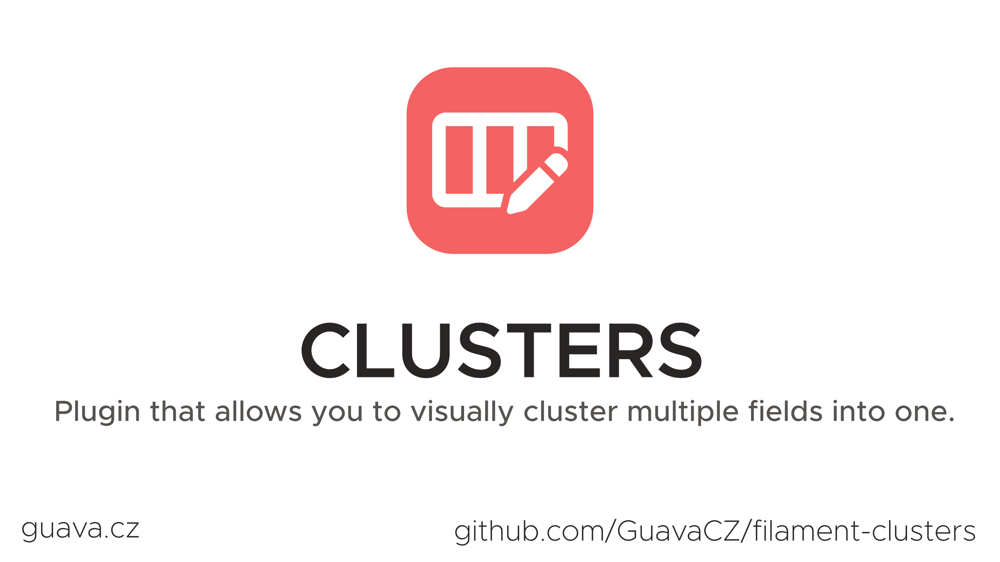
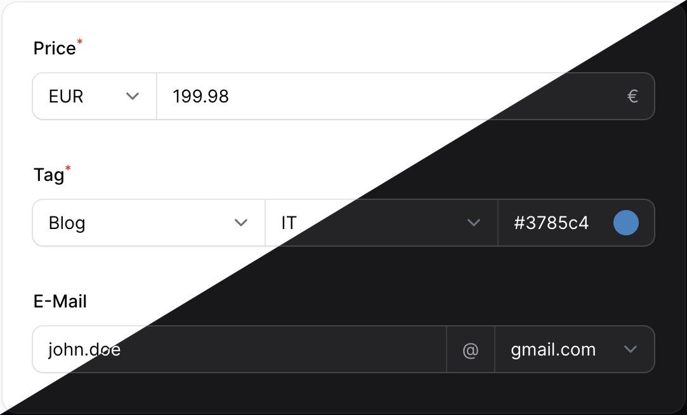

# Filament Clusters

[](https://packagist.org/packages/guava/filament-clusters)
[](https://github.com/guava/filament-clusters/actions?query=workflow%3Arun-tests+branch%3Amain)
[](https://github.com/guava/filament-clusters/actions?query=workflow%3A"Fix+PHP+code+style+issues"+branch%3Amain)
[](https://packagist.org/packages/guava/filament-clusters)

Filament Clusters allows you to visually cluster multiple fields together. 

Functionality wise it is similar to the `Group` component except that the fields look visually as one, which is useful for tighly coupled form fields, such as a currency and amount which only make sense together.

## Showcase



## Support us

Your support is key to the continual advancement of our plugin. We appreciate every user who has contributed to our journey so far.

While our plugin is available for all to use, if you are utilizing it for commercial purposes and believe it adds significant value to your business, we kindly ask you to consider supporting us through GitHub Sponsors. This sponsorship will assist us in continuous development and maintenance to keep our plugin robust and up-to-date. Any amount you contribute will greatly help towards reaching our goals. Join us in making this plugin even better and driving further innovation.

## Installation

You can install the package via composer:

```bash
composer require guava/filament-clusters
```

## Usage

It's simple as:
```php
use Guava\FilamentClusters\Forms\Cluster;

Cluster::make([
    // Your schema
]);
```

For example for a currency and amount cluster: 
```php
use Guava\FilamentClusters\Forms\Cluster;

Cluster::make([
    \Filament\Forms\Components\Select::make('currency')
        ->options(['EUR', 'USD']),
    
    \Filament\Forms\Components\TextInput::make('amount')
        ->numeric()
        ->required(),
]),
```

#### Customization
You can add a label, hint, helper text or actions to your Cluster:
```php
use Guava\FilamentClusters\Forms\Cluster;

Cluster::make([
    // Schema
])
    ->label('My label')
    ->hint('Useful hint')
    ->helperText('Help when you\'re stuck');
```

#### Grid
By default, the cluster automatically distributes the space among each child component. You can however customize it using `columns` and `columnSpan` for each child, just like you're used to from Filament:

```php
use Guava\FilamentClusters\Forms\Cluster;

Cluster::make([
    // Schema
])->columns(5);
```

## Contributing

Please see [CONTRIBUTING](CONTRIBUTING.md) for details.

## Security Vulnerabilities

Please review [our security policy](../../security/policy) on how to report security vulnerabilities.

## Credits

- [Lukas Frey](https://github.com/GuavaCZ)
- [All Contributors](../../contributors)

## License

The MIT License (MIT). Please see [License File](LICENSE.md) for more information.
